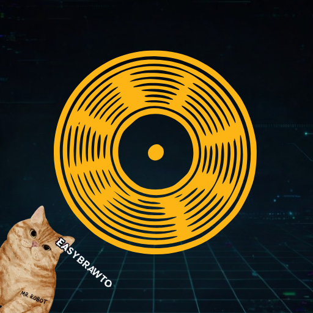

<div align="center">



# easyscrollrec

**Record smooth scroll videos of any webpage — one click, no setup**

*A companion tool to [easybrawto](https://github.com/Saimonsanbr/easybrawto)*

[](https://github.com/Saimonsanbr/easyscrollrec/releases/latest)
[](LICENSE)
[](https://tauri.app)
[](https://github.com/Saimonsanbr/easybrawto)

<br/>

[**⬇ Download for macOS (Apple Silicon)**](https://github.com/Saimonsanbr/easyscrollrec/releases/latest/download/easyscrollrec_aarch64.dmg)
&nbsp;&nbsp;
[**⬇ Download for macOS (Intel)**](https://github.com/Saimonsanbr/easyscrollrec/releases/latest/download/easyscrollrec_x64.dmg)
&nbsp;&nbsp;
[**⬇ Download for Linux**](https://github.com/Saimonsanbr/easyscrollrec/releases/latest/download/easyscrollrec_amd64.AppImage)

</div>

---

## What is this?

easyscrollrec is a small desktop app that records smooth scroll videos of any webpage.

Paste a URL, click Record, get an `.mp4`.

No browser extensions. No screen recording. No Python. Just a native app that captures the full page and animates it with ffmpeg.

## Inspiration

This project was inspired by [scrollrec](https://github.com/viktorkav/scrollrec) by Viktor Kavutar — a great idea for recording scroll videos of webpages.

easyscrollrec takes a different approach: no Python, no Playwright, no headless browser abstractions. Instead it uses **easybrawto** (Crystal + CDP) to talk directly to the browser, and **ffmpeg** for video rendering — tools that feel more native to macOS and Linux, with no runtime dependencies to manage.

---

## How it works

1. Opens a temporary browser profile via **easybrawto** (bundled — no install needed)
2. Navigates to the URL, triggers lazy loading, removes fixed elements
3. Captures a full-page screenshot (up to 15,000px tall)
4. Uses **ffmpeg** to animate a smooth crop — the video scrolls from top to bottom
5. Saves the `.mp4` wherever you want

The trick: it's not a screencast. It's a giant image + an animated crop. Clean, lightweight, no dropped frames.

---

## Requirements

**macOS / Linux:**
```bash
brew install ffmpeg
```

That's it. ffmpeg is the only dependency. The easybrawto binary is bundled inside the app.

---

## Installation

### macOS

1. Download the `.dmg` for your chip (Apple Silicon or Intel)
2. Open the `.dmg` and drag the app to `/Applications`
3. Remove quarantine (required for unsigned apps):

```bash
xattr -dr com.apple.quarantine /Applications/easyscrollrec.app
```

4. Install ffmpeg if you haven't:

```bash
brew install ffmpeg
```

5. Open the app and paste a URL.

### Linux

1. Download the `.AppImage`
2. Make it executable:

```bash
chmod +x easyscrollrec_amd64.AppImage
./easyscrollrec_amd64.AppImage
```

3. Install ffmpeg:

```bash
sudo apt install ffmpeg      # Debian/Ubuntu
sudo pacman -S ffmpeg        # Arch
sudo dnf install ffmpeg      # Fedora
```

---

## Options

| Option | Values | Default |
|---|---|---|
| Speed | Slow / Normal / Fast / Very fast | Normal |
| Quality | 30 fps / 60 fps | 60 fps |
| Output filename | Any `.mp4` name | `scroll_HH_MM_SS.mp4` |

---

## Building from source

Requires [Rust](https://rustup.rs), [Tauri CLI](https://tauri.app/start/prerequisites/), and [Node.js](https://nodejs.org).

```bash
git clone https://github.com/Saimonsanbr/easyscrollrec
cd easyscrollrec
npm install
tauri dev
```

To build a release binary:
```bash
tauri build
```

The easybrawto binaries in `src-tauri/binaries/` must be present before building. Download them from the [easybrawto releases](https://github.com/Saimonsanbr/easybrawto/releases/latest).

---

## Powered by

- [easybrawto](https://github.com/Saimonsanbr/easybrawto) — CDP browser automation (bundled)
- [ffmpeg](https://ffmpeg.org) — video rendering
- [Tauri](https://tauri.app) — native desktop app framework

---

## License

MIT